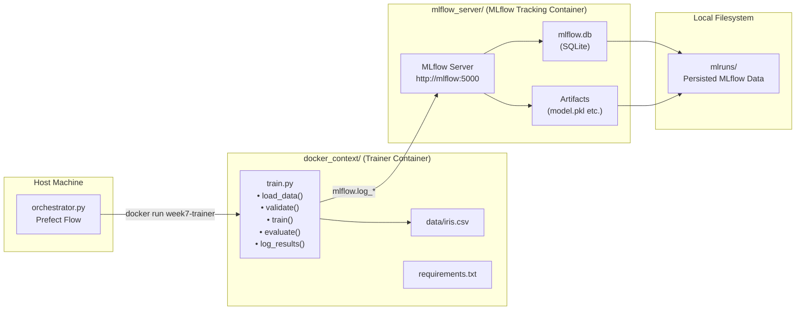

```mermaid
flowchart LR

    subgraph HOST["Host Machine"]
        O["orchestrator.py<br/>Prefect Flow"]
    end

    O -->|docker run week7-trainer| T

    subgraph TRAINER["docker_context/ (Trainer Container)"]
        T["train.py<br/>• load_data()<br/>• validate()<br/>• train()<br/>• evaluate()<br/>• log_results()"]
        D["data/iris.csv"]
        R["requirements.txt"]
    end
    T --> D

    subgraph MLFLOW["mlflow_server/ (MLflow Tracking Container)"]
        M["MLflow Server<br/>http://mlflow:5000"]
        DB["mlflow.db<br/>(SQLite)"]
        A["Artifacts<br/>(model.pkl etc.)"]
    end

    T -->|mlflow.log_*| M
    M --> DB
    M --> A

    subgraph LOCAL["Local Filesystem"]
        L["mlruns/<br/>Persisted MLflow Data"]
    end

    DB --> L
    A --> L
```
