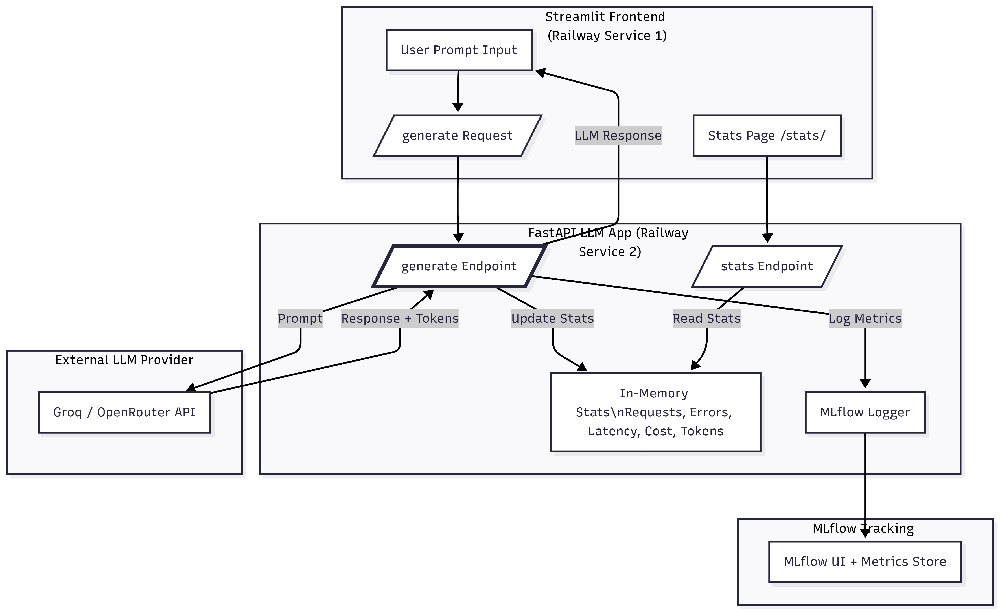
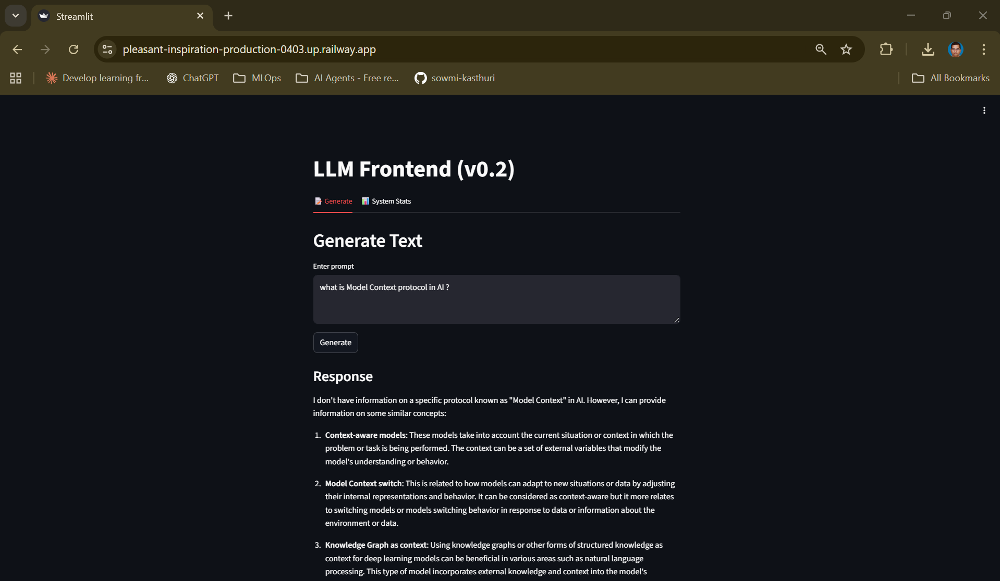
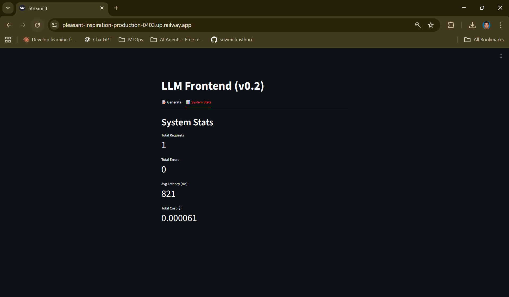
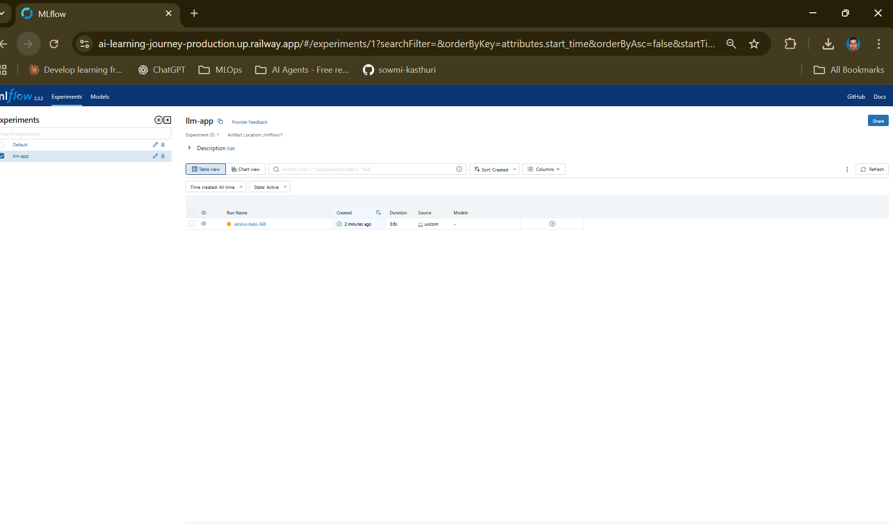
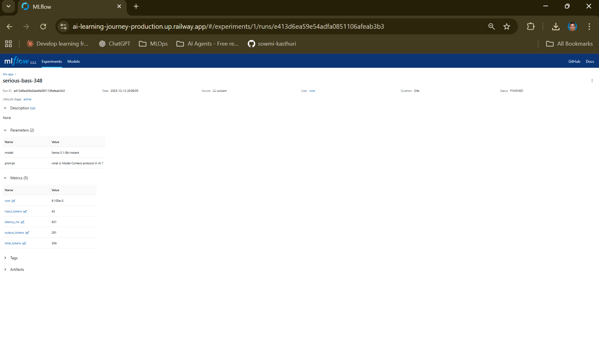
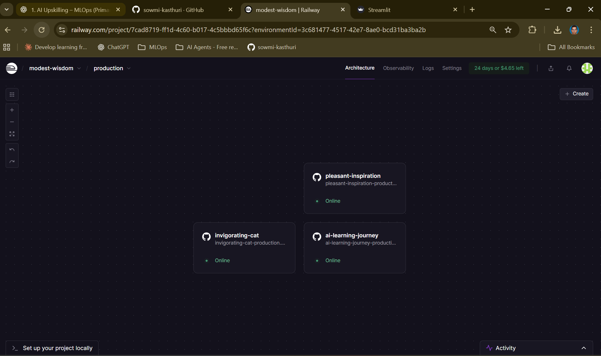

# LLM App – Production Deployment (Week 8)

This project is a lightweight **production LLM system** deployed on Railway, built as part of my Week-8 MLOps upskilling program.

It demonstrates **end-to-end LLM observability** with:

- FastAPI backend (LLM calls + structured metrics)
- Streamlit frontend (prompt UI + system dashboard)
- MLflow tracking (latency, cost, tokens, responses)
- External LLM Provider (Groq / OpenRouter)

Focus: **production thinking over complexity** — simple, reliable, measurable.

---

## 1. Architecture

### Flow Summary

1. User enters a prompt in Streamlit  
2. Streamlit sends POST `/generate` → FastAPI  
3. FastAPI calls external LLM provider  
4. FastAPI computes latency, cost, token usage  
5. FastAPI logs metrics + output to MLflow  
6. FastAPI updates in-memory statistics  
7. Streamlit fetches `/stats` for dashboard display  

Three Railway services work together:

- **Frontend:** Streamlit  
- **Backend:** FastAPI LLM app  
- **Observability:** MLflow Tracking Server  

---

## 2. Features

### ✔ Streamlit Frontend

- Prompt input + response viewer  
- Trace ID display  
- Latency, cost, token usage  
- **System Stats** tab (live dashboard)

### ✔ FastAPI Backend

- `/generate` endpoint (LLM call)  
- `/stats` endpoint (system metrics)  
- `/health` endpoint  
- Structured JSON logging  
- MLflow logging for:
  - latency  
  - cost  
  - input/output/total tokens  
  - full text response  

### ✔ MLflow Observability

- Experiment: `llm-app`  
- Every request creates a run  
- Response saved as `response.txt`  
- Supports long-term cost and performance analysis  

---

## 3. Endpoints

### **POST /generate**

Request:

{
  "prompt": "Explain MLOps in simple terms",
  "model": "llama-3.1-8b-instant"
}

Response:

{
  "trace_id": "uuid",
  "text": "...",
  "input_tokens": 12,
  "output_tokens": 54,
  "total_tokens": 66,
  "latency_ms": 580,
  "cost": "0.000034"
}

GET /stats

{
  "total_requests": 21,
  "total_errors": 0,
  "avg_latency_ms": 612,
  "total_cost": 0.00123
}

## 4. Local Development

### Backend

cd week8_llm_app
uvicorn main:app --reload

### Frontend

cd week8_llm_app/frontend
streamlit run app.py

## 5. Production Deployment (Railway)

The system uses three separate Railway services:

### Service 1 – FastAPI Backend

Environment Variables:
MLFLOW_TRACKING_URI=your-mlflow-url
MLFLOW_EXPERIMENT_NAME=llm-app
OPENROUTER_API_KEY=your-key
GROQ_MODEL=llama-3.1-8b-instant

### Service 2 – Streamlit Frontend

Environment Variables:
FASTAPI_URL=https://{your-fastapi-service}.up.railway.app

### Service 3 – MLflow Tracking Server

Persistent storage enabled
Public URL mapped
Receives all backend logs

## 6. Screenshots

### Generate Tab

### Stats Tab

### MLflow Run

### MLflow Metrics

### Railway Services

## 7. Decisions & Trade-offs

All architectural and design decisions are documented in:

➡️ **[decisions.md](./decisions.md)**

### Key highlights

- Frontend choice (Streamlit)
- Backend API design (FastAPI)
- Deployment platform (Railway)
- Observability strategy (MLflow + in-memory stats)
- Model provider choice (Groq/OpenRouter)
- Architecture simplicity motivations
- Production-grade improvements
- Streamlit chosen for speed + simplicity
- In-memory stats (lightweight, Week-8 scope)
- Railway chosen for clean multi-service deployment
- Observability kept minimal but actionable
- Thin, auditable API design

## 8. Status

🚀 Week 8 Complete
Frontend live
Backend live
MLflow live
Full E2E production integration validated
System is now ready for Week-9 (Quality + CI/CD).

## 9. Load Testing – Local Observability Limitation (Week 9)

- Load was generated against `/generate` using Docker-based k6
- Request counter (`http_requests_total`) was observed incrementing in `/metrics`
- Prometheus scrape targets remained UP during testing
- `rate()` / `increase()` queries intermittently returned zero in local Docker setup
- Root cause attributed to short-lived load bursts and scrape/window misalignment
- Considered acceptable for Week 9 observability wiring validation

## 10. Demo

✅ Demo recording available (see DEMO.md)
